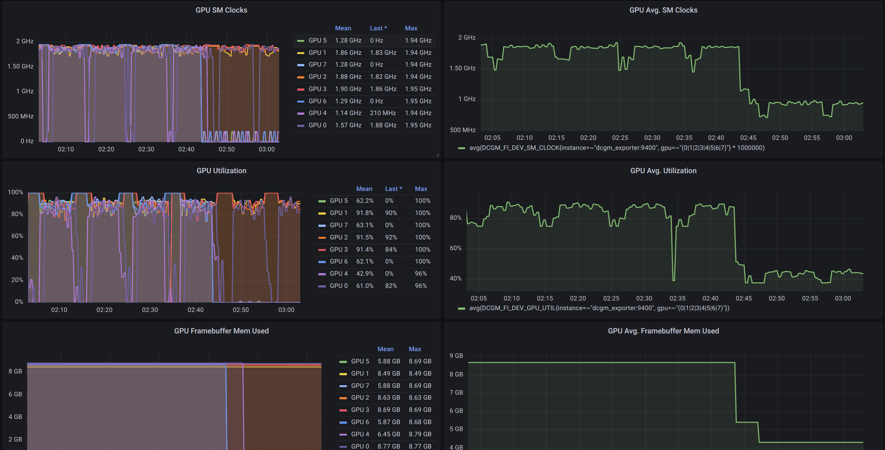

# gpu-monitoring-docker-compose

[Docker Compose](https://docs.docker.com/compose/) file to set up NVIDIA GPU monitoring on a single server using [DCGM-Exporter](https://github.com/NVIDIA/dcgm-exporter), [Prometheus](https://github.com/prometheus/prometheus), and [Grafana](https://github.com/grafana/grafana).

## Prerequisites

1. [NVIDIA Container Toolkit](https://docs.nvidia.com/datacenter/cloud-native/container-toolkit/install-guide.html)
2. [Docker Compose](https://docs.docker.com/compose/install/). Please make sure your docker-compose supports Compose file format [version 3.x](https://docs.docker.com/compose/compose-file/compose-versioning/).

## Set Up

Run the following command to launch containers:

```bash
docker-compose up -d
# or `docker compose up -d` if docker-compose is installed as a Docker CLI plugin
```

Then you can access http://localhost:3000 for Grafana Dashboard (default username: _admin_, password: _admin_).



## Tear Down

Run the following command to stop and remove containers:

```bash
docker-compose down
# or `docker compose down` if docker-compose is installed as a Docker CLI plugin
```

This command will not delete [docker volumes](https://docs.docker.com/storage/volumes/), so the data is still persisted on the server unless you manually delete the volumes.

## Environment Variables

The Compose file contains several environment variables to allow users to populate values inside the Compose file:

| Environment Variable                   | Explanation                                        | Default Value            |
| -------------------------------------- | -------------------------------------------------- | ------------------------ |
| DCGM_EXPORTER_IMAGE_TAG                | Docker tag for dcgm-exporter image                 | 2.4.6-2.6.10-ubuntu20.04 |
| PROMETHEUS_IMAGE_TAG                   | Docker tag for prometheus image                    | v2.36.1                  |
| GRAFANA_IMAGE_TAG                      | Docker tag for grafana image                       | 8.5.6                    |
| DCGM_EXPORTER_HOST_PORT                | Host port for dcgm-exporter container              | 9400                     |
| PROMETHEUS_HOST_PORT                   | Host port for prometheus container                 | 9090                     |
| GRAFANA_HOST_PORT                      | Host port for grafana container                    | 3000                     |
| GRAFANA_ADMIN_USER                     | Admin username of grafana                          | admin                    |
| GRAFANA_ADMIN_PASSWORD                 | Admin password of grafana                          | admin                    |
| PROMETHEUS_STORAGE_TSDB_RETENTION_TIME | `storage.tsdb.retention.time` config of prometheus | 30d                      |

The default values of these environment variables are put inside the `.env` file. You can modify the `.env` file to change these configurations. Alternatively, you can specify your own Environment file by providing `--env-file` option when running `docker-compose` command.

Shell environment variables, which has a higher priority than Environment file,  can also be set to override these values, e.g. `GRAFANA_HOST_PORT=13000 docker-compose up -d`.
